# One million letters, one dollar each, sold exactly once

*Live and fully explorable. Not yet taking payments. See Status below.*

[](https://wordmonument.com)


**[wordmonument.com](https://wordmonument.com)** is a grid of 1,000,000 cells.
Each cell holds exactly one character. Each cell costs exactly one dollar. Each
cell sells exactly once, ever. You pick your cells, you type your word, you pay,
and what you wrote stays on the monument permanently. No edits, no resale, no
accounts, no feed, no algorithm. When the grid is full, it closes forever.

In 2005, a student named Alex Tew sold a million pixels for a dollar each to pay
for university. Twenty-one years later the Million Dollar Homepage is still up,
and it is largely a graveyard: a large share of the linked companies are gone
and the banners point at dead domains. It turns out pixels sold to advertisers
age like advertising.

This project is the same bet with the variable flipped: sell to people instead
of companies, and sell letters instead of pixels. Nobody has an emotional
attachment to a pixel. A letter is a name, a date, a person you lost, a joke
only four people understand. The Million Dollar Homepage was a billboard. This
is a monument.

This repo is the whole thing: the site, the payment pipeline, the moderation
system, the million-cell renderer, and every migration, exactly as deployed.
The rest of this README is the story of the five problems that turned out to be
hard, and how it was built, including the parts that do not flatter it.

---

## Status, stated plainly

The site is **live and fully explorable right now**. You can pan the whole
million-cell grid, zoom to glyph level, select cells, price a word and walk the
entire flow up to the payment step.

It is **in preview**: Supabase and Stripe are not connected yet, so
`/api/reserve` returns a preview notice and the grid renders generated
demonstration content. Every screenshot in this README is the real site in that
state, which means the inscriptions you see are demonstration data, not sales.
**No real money has moved through this system.** Claiming switches on when the
backend is connected.

---

## The rules

1. One dollar per cell, one character per cell.
2. Every cell sells exactly once. No edits, no resale, no exceptions.
3. Maximum 300 cells per transaction, and 300 held cells per IP at any one
   time. Both are concurrency caps, not anti-whale rules. Nothing stops someone
   buying 300, completing, and buying 300 more.
4. What you write is permanent, unless it breaks the content policy, in which
   case it is removed and the cell dies with it. Removed is not resold.
5. When the millionth cell sells, the monument closes. There is no second
   monument.

---

## The loop

The whole pitch fits in one input. Type a word, watch it cost what it costs:
eight letters, eight dollars, forever.

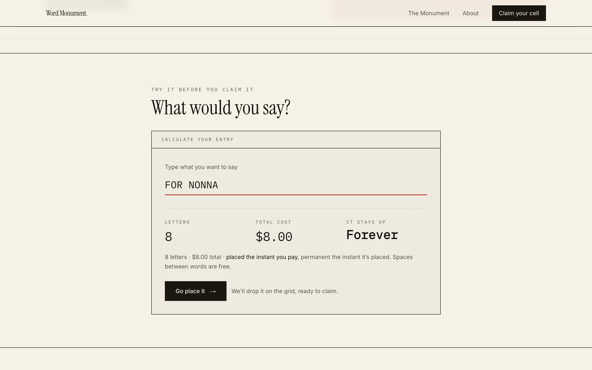

"Go place it" drops the phrase onto the grid as a movable block. From there it
is a placement problem, not a form: drag the whole inscription somewhere that
means something, recolor it, drop cells you do not want, and check out. Spaces
between words are free, so `IN MEMORY OF NONNA` is 15 paid cells, not 18.


The homepage leads with the monument itself rather than a description of it.
The counters read `monument_stats`, a single denormalized row bumped inside
`complete_purchase_atomic` rather than a `COUNT` over a million cells. In the
preview state that row does not exist, so `getMonumentStats` falls back to
generated figures, and the number in this screenshot is one of them.


Each purchase will get a permanent share page, and both the site card and the
per-purchase card are rendered by the app in its own typefaces rather than
being static exports. The per-purchase card is a certificate: the inscription,
the coordinates, the amount, the filing date.

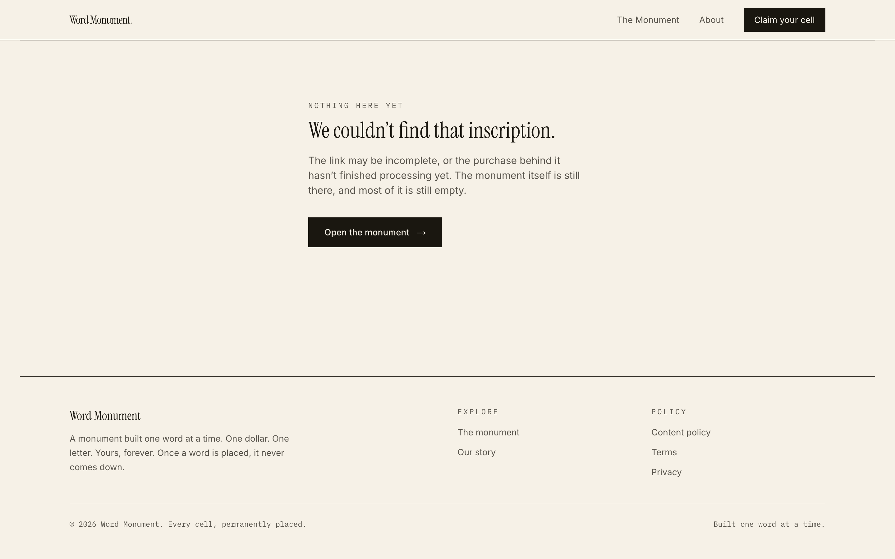

<table>
  <tr>
    <td width="50%">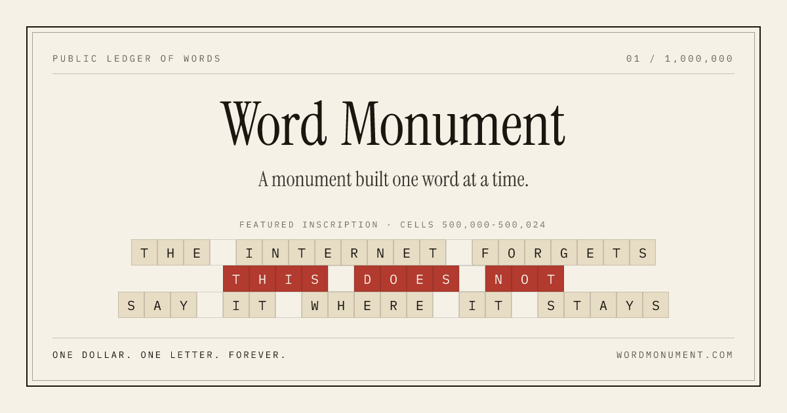</td>
    <td width="50%">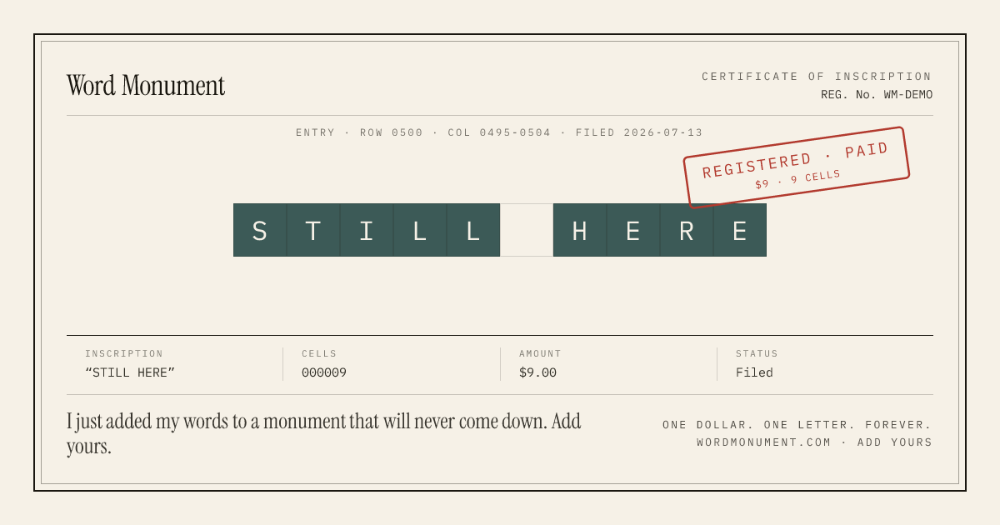</td>
  </tr>
</table>

---

## Problem 1: never sell the same cell twice

This is the entire product. Sell a cell twice and you have either taken money
for nothing or destroyed the one promise the product makes. Everything else can
be mediocre. This cannot.

The naive flow, check whether the cell is free and then write to it, is a race
condition with a credit card attached. Two buyers hit the same cell within
milliseconds, both checks pass, both get charged. So the whole flow is built
backwards from that failure.

**Reservation is one Postgres function, never a check plus a write.**
`reserve_cells_atomic` is `SECURITY DEFINER`, locks the candidate rows with
`SELECT ... FOR UPDATE` in ascending id order so two overlapping requests cannot
deadlock each other, self-heals rows whose hold already lapsed, and then either
reserves every requested cell or reserves none and returns the exact ids that
lost the race. The client gets back a list of which cells to give up, not a
generic conflict. It also takes a `pg_advisory_xact_lock` on the requester's IP
hash first, which serializes concurrent reservations from the same source so
the per-IP hold cap is authoritative rather than another check-then-act race.
The same NAT collision that makes Case One below so dangerous applies to this
lock too, and it is worth saying before somebody says it for me: users behind
one CGNAT exit share a hash and therefore queue behind each other. The blast
radius is different, though. Sharing a lock costs colocated buyers a few
milliseconds. Sharing a release path would have cost them their cells.
Migration `0007_reserve_ip_advisory_lock.sql`, if you want to check.

**The reservation TTL and the Stripe session share one clock.** Stripe enforces
a floor on how soon a Checkout Session may expire, and it is longer than the
ten-minute hold you would naively write. A short database hold behind a longer
payment page is a double-sell with extra steps: the hold expires, someone else
buys the cell, and the first payment still lands. Here the hold is 35 minutes
and the Checkout Session `expires_at` is set to the same instant, so the two
windows cannot disagree by construction.

**The webhook is the only thing that marks cells sold.** It verifies Stripe's
HMAC signature before parsing anything, and it is idempotent: every event id
lands in a table with a unique constraint, so Stripe's retries cannot
double-apply a purchase.

**When the race happens anyway, it is handled rather than ignored.** A payment
can always arrive after a sweep released its hold and someone else bought the
cells. In that case the webhook refunds the exact shortfall automatically and
writes a row to a `payment_anomalies` audit table. A partial fulfilment refunds
the difference, not the whole charge, because the cells that did survive are
genuinely sold and the buyer should keep them.

**Expired holds are swept with `FOR UPDATE SKIP LOCKED`**, so the sweeper can
never block, or be blocked by, a purchase completing in the same instant. The
cron is a safety net behind the event-driven `checkout.session.expired` release
path, not the primary release mechanism.

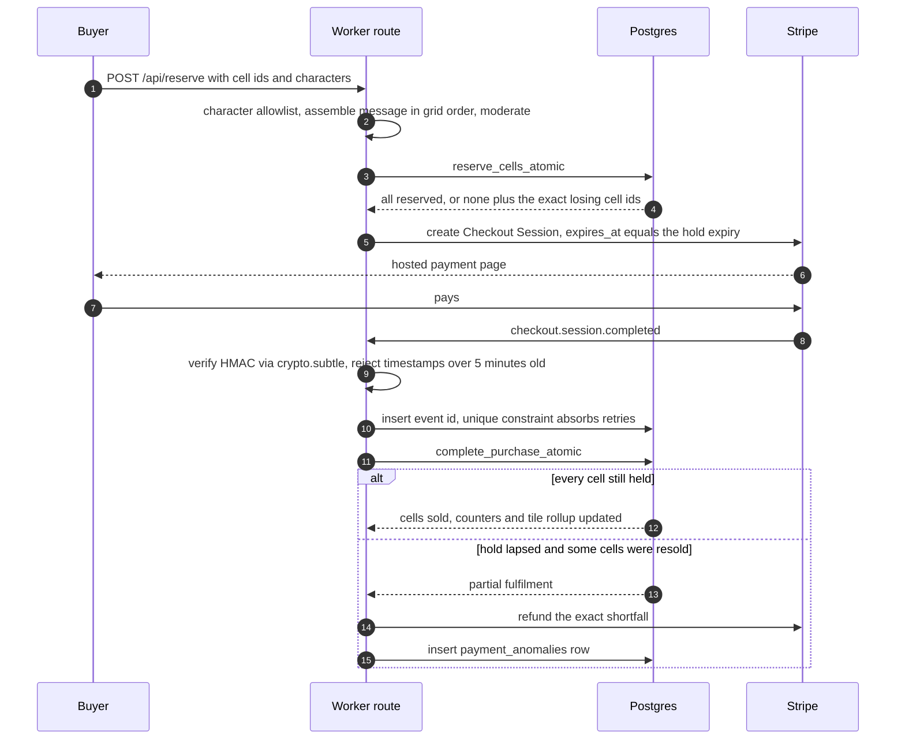

How this was tested, and what was not tested, is in **What was actually
verified** below.

---

## Problem 2: Stripe's SDK does not survive Cloudflare Workers

The official `stripe` npm package hangs under workerd. Not errors: hangs. It
assumes Node HTTP agent internals the Workers runtime does not provide, and
`stripe.checkout.sessions.create()` simply never resolves. A request that never
returns is worse than one that fails, because nothing in your logs looks wrong.

So the Stripe client here is three files and 324 lines of hand-rolled `fetch`
against api.stripe.com/v1: 184 for the REST client, 105 for webhook
verification, 35 for the checkout call. Form-encoded bodies, an
`AbortController` timeout, and nothing else. Webhook signatures are verified
with `crypto.subtle`, which Workers provide natively. Read the raw body before
parsing, cap its size, reject timestamps older than five minutes to kill
replays, constant-time compare the HMAC.

That verifier was attacked during the audit with six malformed and forged
signatures. All six were rejected.

The same reasoning applies to the OpenAI moderation call: raw `fetch`, no SDK.
On Workers, every SDK is a bet that its author never assumed Node internals. A
REST endpoint makes no such assumption.

---

## Problem 3: draw a million cells without melting anything

A million DOM nodes is not a web page. The grid is one `<canvas>` with a
renderer that picks a level of detail from pixels-per-cell.

Canvas 2D, not WebGL, and that was deliberate rather than lazy. The per-frame
draw count stays small at every zoom level, because the level-of-detail system
is what keeps it small. The real bottleneck is viewport-relative data fetching,
not draw-call throughput, so WebGL would have bought shader authoring and
context-loss handling in exchange for solving a problem this renderer does not
have.

| Tier | Pixels per cell | What gets drawn | What gets fetched |
|---|---|---|---|
| 0 | under 2 | one prerendered mosaic of the entire monument | the 400-row tile rollup |
| 1 | 2 to 10 | one filled rectangle per tile, no gridlines | the 400-row tile rollup |
| 2 | 10 to 28 | per-cell rects, ledger lines from 6px, glyphs from 11px | per-cell data for the visible box |
| 3 | 28 and up | full ledger grid, real monospace glyphs, coordinate readout | per-cell data for the visible box |

Default view is 30 pixels per cell, maximum zoom is 64. The threshold that
actually matters is not a tier boundary but `TIER2_GLYPH_MIN_PX = 11`. Glyphs
keep drawing well below tier 3 so a word stays readable as you zoom out, and
they stop at 11 pixels rather than degrading into smears. Grid lines have their
own floor at 6. Tier boundaries decide what gets fetched; those two constants
decide what you can read.

<table>
  <tr>
    <td width="50%">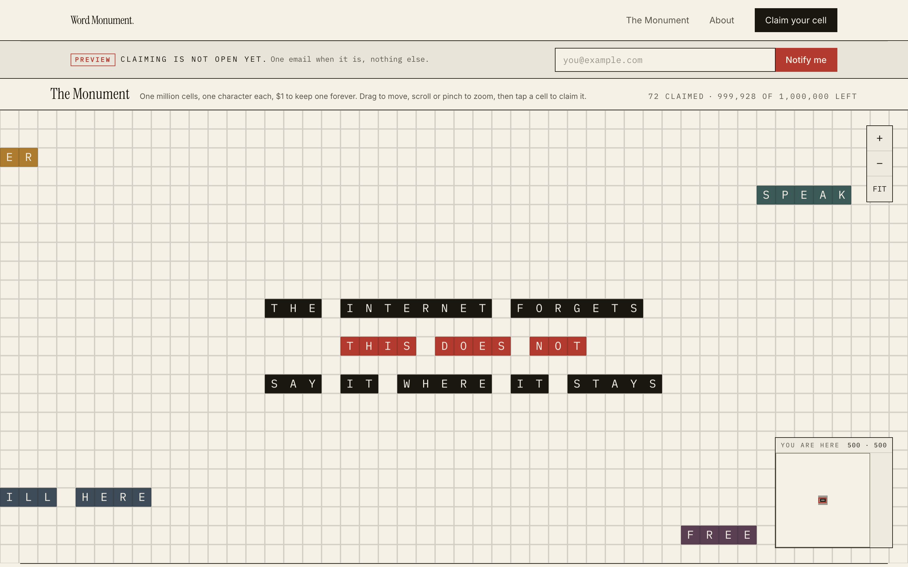<br><em>Default zoom, Tier 3 with glyphs.</em></td>
    <td width="50%">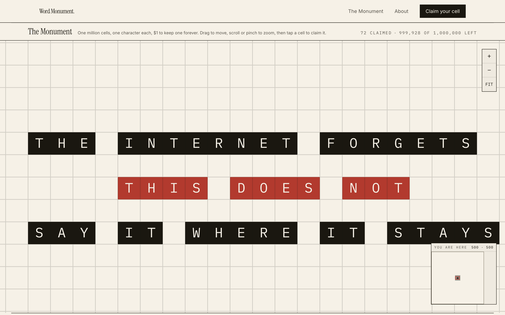<br><em>Zoomed partway in.</em></td>
  </tr>
</table>

**Pan and zoom never touch React.** The viewport lives in a mutable ref, gesture
handlers write to it directly, and a `requestAnimationFrame` loop repaints.
React state updates happen when you select a cell, not sixty times a second
while you drag. Wheel deltas are normalized per browser, because Chrome reports
pixels and Firefox reports lines, and reading `deltaY` raw makes a Firefox notch
and a Chrome notch do wildly different things.

**Cell data arrives through one cached route, in tile-aligned boxes.** The
browser never queries Postgres directly. `/api/grid` snaps every requested
bounding box outward to tile edges, and the edge cache key is derived from the
snapped bounds rather than the raw URL, so panning by one cell, or an attacker
jittering coordinates by a pixel, cannot mint fresh cache entries. This was
verified against the live site: two different raw URLs that snap to the same
tile share a single cache entry. Cloudflare does not cache a Worker's own
response just because it carries `s-maxage`, so the route writes to
`caches.default` explicitly, in code, where it is reviewable, rather than as a
dashboard rule nobody can see in a diff.

That matters because the only traffic this site will ever get arrives in one
burst, and the snapped cache key is the difference between one Postgres read per
tile and one per visitor.

The whole thing is built for a phone first, since that is where a link like this
actually gets opened.

<table>
  <tr>
    <td width="50%">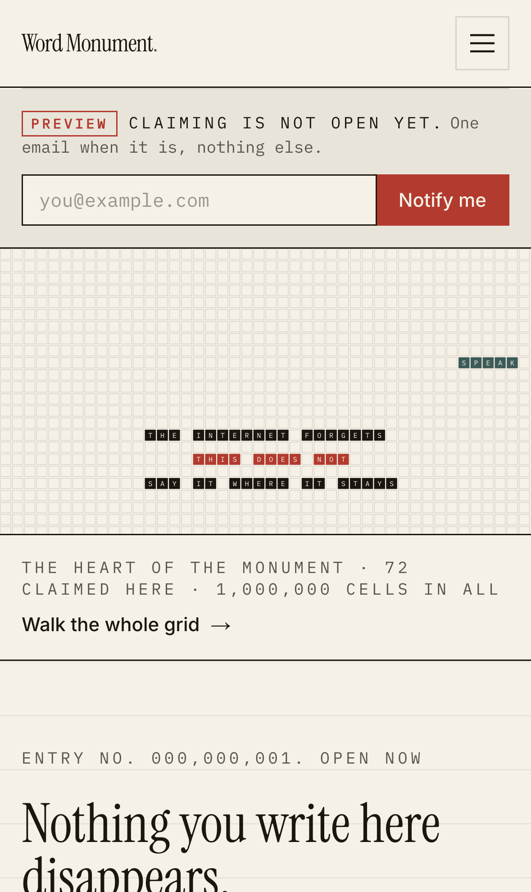</td>
    <td width="50%">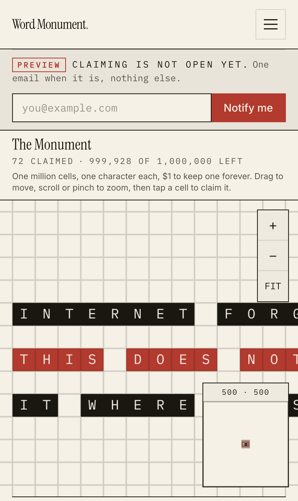</td>
  </tr>
</table>

---

## Problem 4: the public key could have erased the grid

Row Level Security is deny-all on every base table. The only public read surface
is one explicit column-allowlist `VIEW`, `cells_public`, so a column added in a
future migration is invisible to anonymous readers by default rather than
leaking the moment somebody forgets to write a policy. Everything that writes
goes through `SECURITY DEFINER` functions called with the service role, from the
server, never from the browser.

That is the design. The reason it is written that way is a finding, and the
finding is the most uncomfortable thing in this repo.

An audit pass proved that the public anonymous key could **erase the monument**.
Not in theory: the proof replayed Supabase's own bootstrap privileges inside a
local PostgreSQL instance, applied all 13 migrations, then connected as the
anonymous role and ran an `UPDATE` that turned a sold cell back to `available`,
wiping its character. Supabase's bootstrap grants are broader than most people
assume, particularly what they hand to `anon` on views, and a view created the
obvious way inherits enough to be writable.

Migration `0010` exists solely to close that. If you run Supabase yourself, go
read what its bootstrap actually grants to `anon`. It is the closest this
project came to shipping a grid that a stranger with a key printed in the
JavaScript bundle could have deleted.

There are no third-party analytics, no ad pixels, and no cookies beyond the
admin session. There is exactly one piece of first-party measurement, and
pretending otherwise would be a lie you could catch in thirty seconds: the
homepage A/B tests its headline, so `/api/hero/impression` records which variant
was shown and `reservation_hero_variant` records which variant a completed
purchase came from. That is two of the eleven tables and one of the nine routes.
The comment at the top of that route file calls it low-stakes analytics, which
is what it is. Buyer IPs are never stored raw, only as HMACs keyed by a
server-side secret, which is what makes rate limiting and per-IP hold caps
possible without keeping a list of who visited.

---

## Problem 5: people will type things you do not want to sell

A dollar is cheap enough that somebody will try to write a slur across the
middle of the grid on day one. Moderation is two layers, on purpose.

**Before a reservation exists.** The characters themselves are an explicit
allowlist: letters, digits, a small punctuation set, and a curated emoji list
compared by exact string, because Unicode grapheme tricks are a real attack
surface and a length check in Postgres counts codepoints, which is the wrong
unit for an emoji. The assembled message is then checked against a blocklist in
**grid reading order, not selection order**, so you cannot hide a slur by
clicking its letters out of sequence. Normalization catches the homoglyph games.
This gate runs before the hold, because a reservation locks cells away from real
buyers for 35 minutes, and letting garbage burn hold slots is a denial of
service against people trying to give you money.

**After payment.** An async check runs on sold content and flags rather than
deletes, a public report button exists on every sold cell, and a password-gated
admin queue reviews flags. A second cron sweeps sold cells whose check has not
run yet, so a moderation API outage delays review instead of skipping it.
Removal blanks the cell permanently and logs the action. The cell is not resold.

The failure mode that cannot be prevented in software: two innocent purchases
landing next to each other and reading as something else. That one is policy,
reporting and a fast admin, not code.

---

## How this was built

Six days, from 2026-07-26 to 2026-07-31. It was written with **Claude Code**,
using **Claude Opus 5** and **Claude Fable 5**, run in a mode I call ultracode:
a workflow script fans work out across many subagents in parallel and pipelines
them through stages, so exploration, implementation, review and verification are
separate populations of agents rather than one model talking to itself.

"AI wrote it" is not the interesting part. The interesting part is what was done
to the output afterwards.

### Adversarial verification

Every finding produced by one agent was handed to independent agents whose
explicit job was to **refute it**, with instructions to default to "not a bug"
when uncertain. A finding survived only if it could be independently reproduced.
Generation is cheap and confident, which makes agreement worthless. The only
useful output of a second agent is a reproduction or a refutation.

This caught real things, including the case that matters most: **the AI's own
proposed fix was the bug.**

**Case one, the fix that would have stolen a stranger's cells.** A reviewer
found that expired reservations could linger, and proposed releasing them by
matching on `reserved_by_ip_hash`. It looks correct. It reads correct. The
adversarial pass killed it, because an IP hash is not a person: NAT, CGNAT and
shared VPN exits mean thousands of unrelated users collapse to one hash. The fix
would have let one user's cleanup free a completely different user's hold, in
the middle of that user's checkout, seconds before their payment landed. The
change was reverted entirely rather than patched, because the identity it relied
on does not exist.

**Case two, the grid a stranger could erase.** The anonymous-key finding in
Problem 4 was not accepted on the strength of an argument. An agent stood up a
local PostgreSQL, replayed Supabase's bootstrap grants, applied all 13
migrations, connected as `anon` and wrote to the monument. A claim about
privileges is an opinion. An `UPDATE` that returns `UPDATE 1` is not.

### What was actually verified, and what was not

Verification ran against a real PostgreSQL 17, not mocks:

- 40 payment-logic assertions, including concurrent reservations over
  intersecting cell sets, expiry sweeps racing completion, and partial
  fulfilment refunds.
- All 13 migrations applied under Supabase-like bootstrap privileges, then
  probed as the anonymous role.
- Webhook signature verification attacked with six malformed and forged
  signatures. All rejected.

And the caveat that belongs in the same breath: **no real money has moved
through this system yet.** Stripe has not run a live charge here. Everything
above is tested logic and a hardened path, not a track record. Treat it as such,
and if you find something these agents missed, that is a genuinely useful
finding and the issue tracker is open.

### What the six days produced

| | |
|---|---|
| TypeScript and TSX files in `src/` | 114 |
| Lines in `src/` | about 12,000 |
| SQL migrations | 13, totalling 1,765 lines |
| Postgres functions | 11 |
| Tables | 11 |
| API routes | 9 |
| React components | 32 |
| **Runtime dependencies** | **6** |
| Worker bundle, gzipped | 2.2 MB |

Those six runtime dependencies are `next`, `react`, `react-dom`,
`@supabase/supabase-js`, `@number-flow/react` and `bcryptjs`. No state
management library, no canvas library, no UI kit, no ORM at runtime. Not
minimalism for its own sake: on a Workers runtime, every dependency is a bet
that someone else's package does not assume Node internals, and Stripe's own SDK
is the cautionary tale that made the bet feel expensive.

---

## Architecture reference

### The stack, and why it is boring on purpose

| Piece | Choice | The reason |
|---|---|---|
| Framework | Next.js 15.5, App Router | Server rendering for the pages crawlers read, client canvas for the grid |
| Runtime | Cloudflare Workers via `@opennextjs/cloudflare` | Pages and the grid route run at the edge. The only origin is Postgres, and grid reads are cached in front of it |
| Database | Supabase Postgres | The concurrency model is row locks and `SECURITY DEFINER` functions, which wants a real Postgres |
| Payments | Stripe hosted Checkout | Card data never touches this codebase, and the hosted page is the one thing buyers already trust |
| Styling | Tailwind v4, CSS-first | No config file, tokens live in CSS where the design system does |
| Cache | R2 plus two KV namespaces plus the edge Cache API | ISR in R2, rate limiting in one KV, the Next cache in another, deliberately separate so an incident in one is not confused with the other in logs |
| State | A hand-rolled store on `useSyncExternalStore` | The selection is a Set and a subscribe function; a state library would be more code than the state |
| Auth | None for buyers, one password for the admin | Accounts are a database of emails waiting to leak, and the product does not need them |

### Schema shape

Eleven tables. The ones that carry the design:

- **`cells`**, one row per cell, seeded with all 1,000,000 up front. The primary
  key is `y * 1000 + x`, so a single integer is also a stable, sortable,
  human-debuggable coordinate. `character` is `text`, not `char(1)`, because a
  curated emoji can be several codepoints and Postgres length is codepoint
  based.
- **`tile_summary`**, exactly 400 rows for the 20x20 grid of 50x50 tiles. This
  is what feeds LOD tiers 0 and 1. It is updated by one batched statement inside
  `complete_purchase_atomic`, not a per-row trigger, so completing a purchase
  stays cheap and predictable.
- **`monument_stats`**, one row, enforced by a boolean primary key defaulting to
  true. Global counters for the live tally.
- **`stripe_webhook_events`**, the idempotency ledger. Event id is the primary
  key, which is the whole mechanism.
- **`payment_anomalies`**, the audit trail for automatic refunds, so a race that
  cost somebody money is a row you can read rather than a log line you lost.
- **`cell_reports`** and **`moderation_actions`**, the public report path and
  its paper trail.

There is deliberately **no purchases table**. `reservation_id` is not cleared on
sale, so it survives as the purchase-grouping key for success pages, share
cards and highlights.

The only surface an anonymous client can read is the `cells_public` view, which
lists its columns explicitly.

### Routes and jobs

Nine API routes: `reserve`, `checkout`, `reservation/[id]`, `grid`,
`webhooks/stripe`, `reports`, `hero/impression`, and two cron endpoints.

Two cron triggers on the Worker, which is also why `main` points at a
`custom-worker.ts` rather than OpenNext's generated entry: OpenNext only exports
a `fetch` handler, and these need a `scheduled` one beside it.

- `*/5 * * * *`, expired-reservation sweep, comfortably ahead of the 35-minute
  TTL, and a backstop rather than the primary release path.
- `11,26,41,56 * * * *`, moderation retry sweep for sold cells whose async check
  never completed.

---

## Run it yourself

```bash
git clone https://github.com/Hiberius/word-monument
cd word-monument
npm install
npm run dev
```

With no configuration it runs in demo mode with generated content and payments
disabled, which is enough to explore everything described above, including the
full renderer and the selection flow.

Wiring it up for real needs a Supabase project, Stripe test keys, a Turnstile
key pair, an OpenAI key for the second moderation layer, and a handful of
generated secrets. All of it, including the migration order, the Stripe CLI
webhook forwarding loop, the Cloudflare KV and R2 setup, the
`NEXT_PUBLIC_*`-must-exist-at-build-time trap, and the pre-launch checklist, is
in **[docs/SETUP.md](docs/SETUP.md)**. Deployment is `npm run ship`.

One thing worth repeating from that document, because it is the failure that
wastes the most time: `NEXT_PUBLIC_*` values are inlined into the bundle at
build time, so putting them in `wrangler secret` means the browser reads
`undefined`, the Turnstile widget silently never renders, and nobody can
complete a checkout, with no error anywhere to explain it.

---

## Questions I expect

**Is this the Million Dollar Homepage?**
It is a tribute to it and an argument with it, in equal parts. Same economics,
opposite audience. Tew sold to advertisers, this sells to people. His page
became a wall of dead links because everything on it pointed elsewhere. Nothing
here points anywhere; the words are the destination.

**Why would anyone pay a dollar for a letter?**
The same reason people carve initials into benches and pay for stars they will
never visit. It is not a rational purchase. Neither is a bench plaque. Nothing
has sold yet, so this is arithmetic and not observation: a five-letter name is
$5, a date written out is $10, a short sentence is around $40. Spaces are free.

**What stops it all being deleted next year?**
Less than you would like, honestly: a public promise, the terms of service, and
the fact that the entire codebase and its history are in this repo for anyone to
fork.

**What happens when it sells out?**
It closes to new purchases and stays up. Selling out is the finished state, not
the successful one.

**Can I buy a region and write a manifesto?**
Up to 300 cells per purchase, and the content policy applies to what you write.
Beyond that, the grid is first come, first carved.

**Is the AI part a gimmick?**
The build was AI-assisted end to end, and saying so is more useful than hiding
it. The part worth copying is not the code generation, it is the verification
posture: assume the generated fix is wrong, task independent agents with proving
it, and ship only what survived. The most dangerous change in this project was
introduced by a reviewer and killed by adversarial review of that review. The
second worst was a latent design flaw that survived every argument about it and
died the moment somebody ran it against a real Postgres.

---

<details>
<summary>More screenshots</summary>

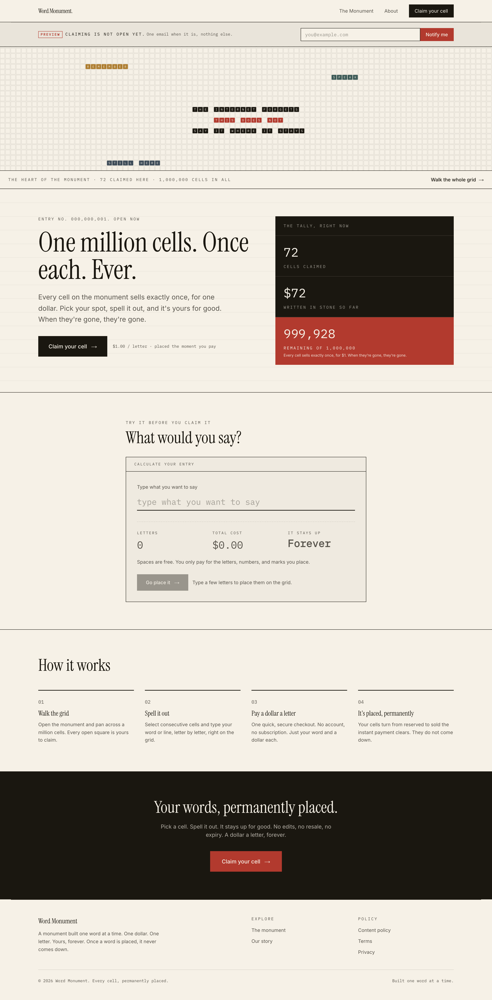


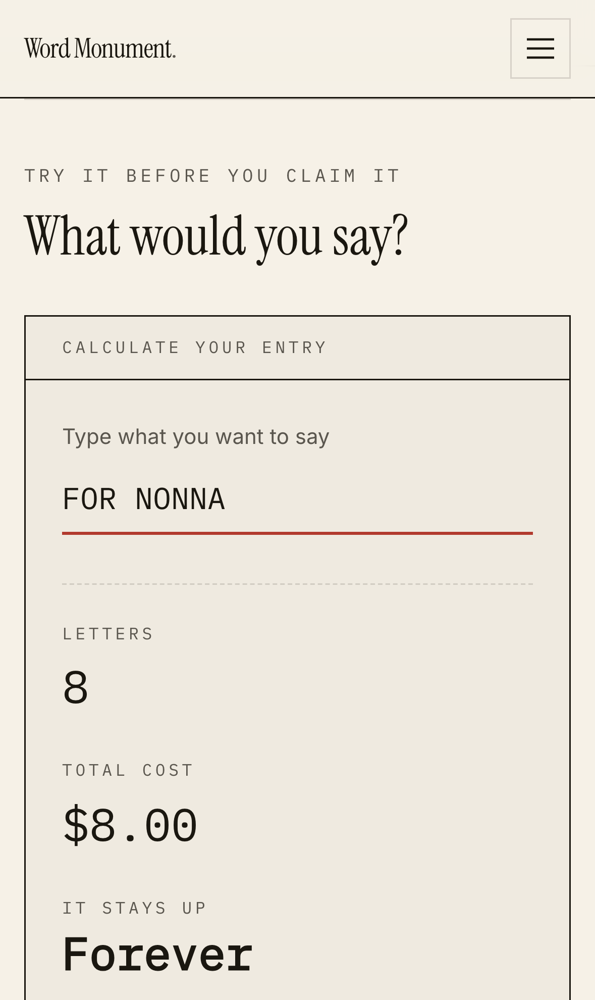

</details>

---

The commit history is the honest build log, arguments with reviewers included.
The author is deliberately anonymous, and the code is public so the promise
above can be checked rather than trusted. If you write something on the monument
that means something, I would genuinely like to know the story:
hello@wordmonument.com.
